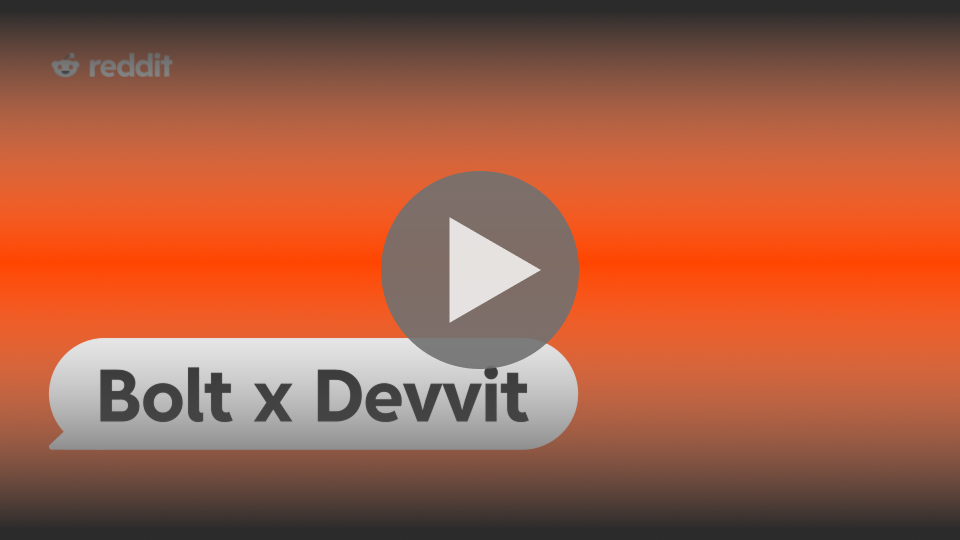

## Devvit Bolt Starter Experimental

(forked from https://github.com/reddit/devvit-react-starter-experimental)

An experimental starter that explores a new way to build applications on Reddit's developer platform.

## Video Tutorial

[](https://www.youtube.com/watch?v=bcOm7NE30c4)

## Getting Started
 
This template is made specifically to work with [Bolt.new](https://bolt.new)

[Click here to test this template in Bolt](https://bolt.new/github.com/reddit/devvit-bolt-starter-experimental)

As soon as the project is checked out you will get the following errors.
**This is expected**!

```
❌  Authentication: Please run npm run login to authenticate with Reddit
❌  App initialization: Please run npm run devvit:init to setup your app remotely
❌  Playtest subreddit: Please update YOUR_SUBREDDIT_NAME in the dev:devvit script in package.json
```

### Step 1: Login

Run `npm run login` to authenticate with Reddit. You will be prompted to follow a link and paste an authentication code. Paste that authentication code in your **terminal window** in Bolt, then press `<Enter>`. After that you, if you run `npm run dev` again, you should get the following:

```
✅  Authentication: You're logged in to Devvit!
❌  App initialization: Please run npm run devvit:init to setup your app remotely
❌  Playtest subreddit: Please update YOUR_SUBREDDIT_NAME in the dev:devvit script in package.json
```

### Step 2: App Initialization

Run `npm run devvit:init` and follow the steps. You will be prompted to follow a link and paste an authentication code. Paste that authentication code in your **terminal window** in Bolt, then press `<Enter>`. After that you, if you run `npm run dev` again, you should get the following:

```
✅  Authentication: You're logged in to Devvit!
✅  App initialization: App has been initialized
❌  Playtest subreddit: Please update YOUR_SUBREDDIT_NAME in the dev:devvit script in package.json
```

### Step 3: Playtest subreddit

For this step, you will need to go to Reddit and create an empty subreddit for you to test your app. You can do this by following going to [Reddit](https://www.reddit.com) and clicking the **"Create a Community"** button in the left-side navigation. Once you create your community, paste the name of the subreddit (for example if you community is reddit.com/r/my_test_subreddit, you will paste `my_test_subreddit`) into the `package.json` file, replacing the string `YOUR_SUBREDDIT_NAME`. After that, if you run `npm run dev` again, all checks should pass and you should be able to test your application on Reddit.

```
✅  Authentication: You're logged in to Devvit!
✅  App initialization: App has been initialized
✅  Playtest subreddit: Subreddit is configured!

All checks passed! Starting development server...
```

### Step 4: Testing your app

Once the initial configuration is done, you can test your application by navigating to your test subreddit, clicking the three dots icon on the top-right and creating a new post. The command will be called `[Bolt Word Guesser] New Post`. Once you create a new post you can go back and forth with Bolt by prompting your way to making your app and testing it on Reddit
